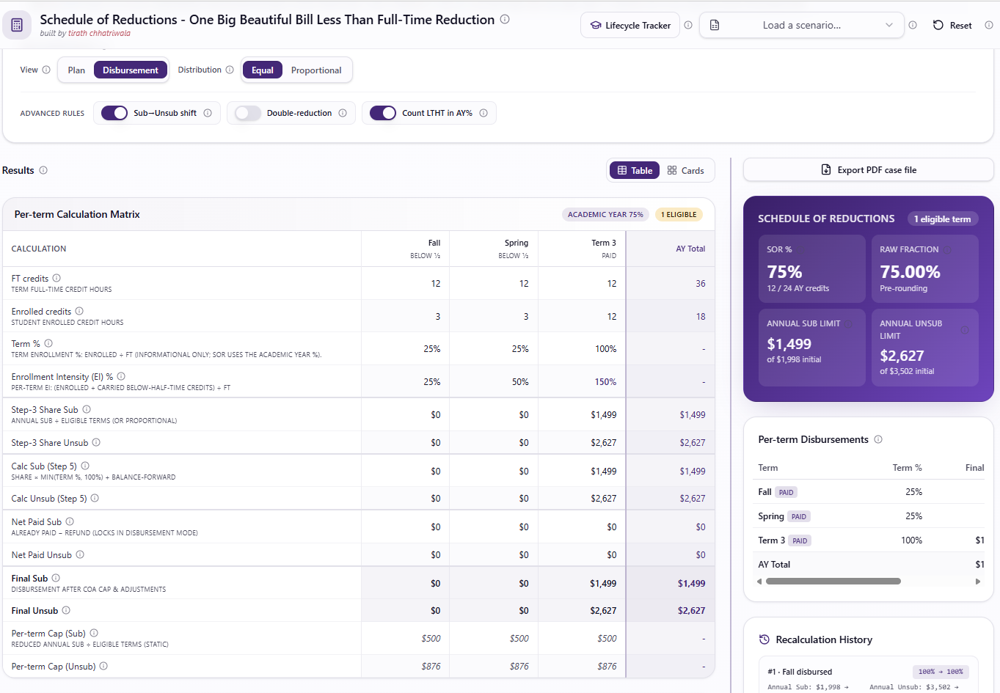

# Project SOR — Schedule of Reductions Calculator

**An interactive calculator for the OBBBA Less-Than-Full-Time Reduction (Schedule of Reductions) for Direct Subsidized and Unsubsidized loans, 2026–27 award year.**

Built and maintained by **Tirath Chhatriwala**, Principal Product Manager at Anthology / Ellucian.

> 🚀 **Try it now → [sor.myproduct.life](https://sor.myproduct.life)**
>
> Source: <https://github.com/tirath5u/project-sor>

---

## Screenshot



_Drop a screenshot at `docs/screenshot.png` to populate this preview._

---

## What it does

- **Reduced annual Sub/Unsub baselines** computed from grade level, dependency status, Parent PLUS denial, and (optionally) override caps.
- **Per-term disbursement amounts** with proper rounding-to-dollar correction so the term sum equals the reduced annual amount (no orphan pennies).
- **History-anchored disbursement view** — committed `Paid Sub` / `Paid Unsub` per term anchor independently and the engine redistributes the remaining pool only across future eligible terms.
- **Case-file PDF export** of inputs, calculated baselines, per-term disbursements, and the 6-step walkthrough — useful for audit packages and sprint review.
- **12 ED-provided scenarios preloaded** (April 2026 Q&A) so you can verify behavior against the published expected math.

---

## Who this is for

| Audience | What you get |
|---|---|
| **Financial aid administrators (FAA)** | Plain-English walkthrough of how OBBBA's LT-FT reduction lands on a real student, term by term. |
| **SIS / FA developers** | A reference engine + tests for the SOR formula, rounding rules, and disbursement anchoring you can compare your own implementation against. |
| **QA engineers** | The 12 ED scenarios as one-click presets, plus a property-style test suite covering edge cases (mid-cycle drops, partial entry, override caps). |
| **Product managers** | A worked example of converting regulatory ambiguity into shippable acceptance criteria, with sources cited inline. |

---

## The 5-step SOR formula (compressed)

1. **Statutory annual limits** for Sub and Unsub from the grade-level lookup (or override).
2. **Annual financial need** is split into Sub-eligible and Unsub-eligible buckets.
3. **Award-year enrollment intensity** is computed from per-term enrolled vs. full-time credits, weighted by term length.
4. **Reduced annual amounts** = lesser-of(statutory cap, need bucket) × enrollment-intensity %.
5. **Per-term disbursements** spread the reduced annual across active terms, with a rounding pass that pushes any cent residual into the last eligible term so the sum is exact.

---

## Hard rules teams miss

- **Sub and Unsub anchor independently.** Entering `Paid Sub = 666` for a term must NOT zero out that term's `Paid Unsub`. Each loan type has its own history.
- **Blank ≠ zero.** A `Paid Unsub` field that has not been entered is *pending*, not *committed zero*. The engine should only redistribute Unsub forward after the user explicitly enters or confirms `0`.
- **Enrollment intensity is award-year-level**, not term-level. A student going 12/6/12 is not "full-time, half-time, full-time" — they are at one weighted AY%.
- **Combined limit is the ceiling.** Unsub baseline = `max(0, combinedLimit − subBaseline)`. Override mode does not let you exceed the lookup combined limit unless you intentionally override that cap too.
- **Round-to-dollar at the term level**, not the annual level. Per-term values are integer dollars; the rounding residual lands in the last eligible term.
- **Mid-cycle disbursement requires history.** Once any term is marked Disbursed, the engine treats that term's Paid amounts as locked and only adjusts future terms.
- **Grad/Prof has no Sub.** Sub baseline is forced to 0 for graduate and professional grade levels regardless of override.

---

## How to use the tool

1. **Pick a scenario** from the left rail (or start blank). The 12 ED scenarios from the April 2026 Q&A are grouped by case type.
2. **Adjust inputs** — grade level, dependency, annual need, term count, full-time vs. enrolled credits per term, optional summer/winter terms.
3. **Read the 6-step walkthrough** on the right. Every number on screen has a citation back to the input that produced it.
4. **Switch to Disbursement view** to enter `Paid Sub` / `Paid Unsub` per term and see the engine re-anchor the remaining pool.
5. **Export the PDF** for audit, sprint review, or a vendor conversation.

---

## Sources & confidence

Every rule encoded in `src/lib/sor.ts` traces back to one of:

- **Confirmed** — published in a Dear Colleague Letter, Electronic Announcement, the COD Tech Ref, or the April 2026 ED Q&A.
- **Inferred** — derived from the regulation text or a Vendor Focus Group clarification, but not yet in published guidance.
- **Pending** — known open question, with the current behavior chosen as the safest default until ED confirms.

If you spot a rule that disagrees with newer ED guidance, please open an issue with the source.

---

## Local development

Requires [Bun](https://bun.sh) (or use `npm` / `pnpm` equivalents).

```bash
bun install
bun dev          # start the dev server
bun test         # run the SOR engine test suite
bun run build    # production build
```

**Tech stack:** TanStack Start v1 (React 19, file-based routing, SSR) · Vite 7 · Tailwind CSS v4 · shadcn/ui · jsPDF for the case-file export.

The calculation engine lives in `src/lib/sor.ts` with a comprehensive test suite in `src/lib/sor.test.ts`. The 12 ED scenarios are in `src/lib/scenarios.ts`. UI is split between `src/routes/index.tsx` (calculator) and `src/components/sor/*` (presentational pieces).

---

## Contributing & issues

Please open a GitHub issue if you find:

- A calculation that disagrees with an ED-published scenario or the COD Tech Ref
- A reversal in newer guidance that this tool hasn't picked up yet
- A missing edge case (mid-cycle drop, override + Parent PLUS denial interaction, unusual term lengths, etc.)
- A UX confusion in the disbursement entry flow

Pull requests welcome. Please include a test in `src/lib/sor.test.ts` for any engine change.

---

## Disclaimer

This tool is **not** an official U.S. Department of Education publication, **not** an Anthology or Ellucian product, and **not** a substitute for the COD Technical Reference, Dear Colleague Letters, or your institution's compliance review. It is a working reference built by a practitioner for practitioners, provided as-is for educational and operational reference.

Always validate against the current COD Tech Ref Volume 2 and the most recent ED Electronic Announcement before making a disbursement decision.

---

## Author

**Tirath Chhatriwala** — Principal Product Manager, federal student aid technology.

- 🌐 Hub: [myproduct.life](https://myproduct.life)
- 🛠 This tool: [sor.myproduct.life](https://sor.myproduct.life)
- 💼 LinkedIn: _add your URL here_
- 📂 More projects: <https://github.com/tirath5u>

Project SOR is the first tool in the **myproduct.life** umbrella — a small, growing collection of practitioner-built tools, strategy notes, and product-thinking writing.