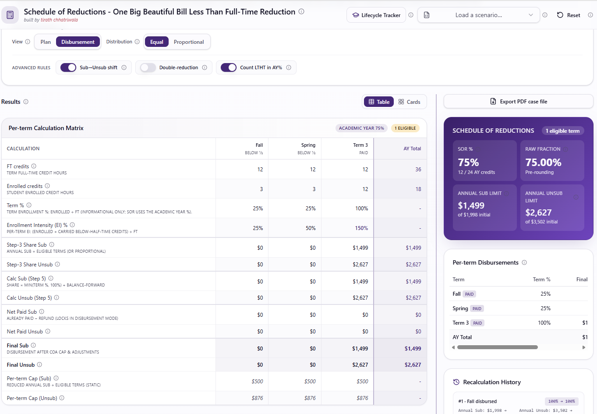

# Project SOR: Schedule of Reductions Calculator

An open-source, parity-tested implementation of the OBBBA Less-Than-Full-Time Reduction (Schedule of Reductions) for federal Direct Subsidized and Unsubsidized loans, with a free public HTTP API.

Built and maintained by **Tirath Chhatriwala**, Product Manager with over 14 years of experience in EdTech, Higher Education and FSA Regulatory Compliance.

[](https://github.com/tirath5u/project-sor/actions/workflows/ci.yml)
[](LICENSE)
[](https://sor.myproduct.life/api/public/v1/health)
[](https://sor.myproduct.life/api-docs)

> **Try it now:** [sor.myproduct.life](https://sor.myproduct.life)
>
> **API docs:** [sor.myproduct.life/api-docs](https://sor.myproduct.life/api-docs)
>
> **Source:** <https://github.com/tirath5u/project-sor>
>
> **Remote MCP:** `https://sor.myproduct.life/mcp` for MCP clients that support remote custom servers.
>
> **Student estimate:** [sor.myproduct.life/student](https://sor.myproduct.life/student) provides a narrow standard Fall and Spring estimate with clear school-review boundaries.

---

## Try it in 30 seconds

```bash
# Service liveness + version metadata
curl https://sor.myproduct.life/api/public/v1/health

# Published scenario catalog with regulatory citations
curl https://sor.myproduct.life/api/public/v1/scenarios | jq '.scenarios | length'

# Run the first published scenario through the engine
curl -X POST https://sor.myproduct.life/api/public/v1/calculate \
  -H 'Content-Type: application/json' \
  -d "$(curl -s https://sor.myproduct.life/api/public/v1/scenarios | jq '.scenarios[0].input')"
```

The dollars you get from the API match the dollars you get from the web UI match the dollars in the published fixture catalog. One engine, three views, zero drift.

---

## Screenshot



---

## What this is

A reference implementation of the Schedule of Reductions math for award years 2025-26 and 2026-27, defined by 34 CFR 685.203 and amended by the OBBBA. Project SOR is a source-backed Schedule of Reductions calculation engine available through Excel, the web, a REST API, and a remote MCP server. The same tested engine supports detailed staff workflows, student-friendly estimates, and AI-assisted scenario intake.

## What this is not

Not an official U.S. Department of Education publication. Not an Anthology or Ellucian product. Not legal or compliance advice. No real student data is or will ever be in this repo. All scenarios use synthetic personas or federally-published examples.

This calculator is an SOR engine. It does not determine NSLDS remaining aggregate eligibility, lifetime maximum eligibility, Parent PLUS remaining eligibility, consolidation allocation, or final Grad PLUS eligibility. Those ceilings must be resolved before relying on the SOR output.

Always validate against the current COD Technical Reference Volume 2 and the most recent ED Electronic Announcement before making a disbursement decision.

---

## What it does

- **Reduced annual Sub/Unsub baselines** computed from grade level, dependency status, Parent PLUS denial, and optional override caps.
- **Graduate and professional Sub/Unsub annual caps** including the 2026-27 professional annual Unsub cap for non-grandfathered borrowers.
- **Grad PLUS preview only for legacy or interim-exception scenarios.** The engine does not model NSLDS aggregate or lifetime remaining eligibility.
- **Per-term disbursement amounts** with proper rounding-to-dollar correction so the term sum equals the reduced annual amount (no orphan pennies).
- **History-anchored disbursement view:** committed Paid Sub / Paid Unsub per term anchor independently and the engine redistributes the remaining pool only across future eligible terms.
- **V56 child/module allocation:** an optional child ledger allocates each already-calculated parent-term gross payout by child credits or equally across active credited child terms. Zero-credit children receive $0, paid child gross remains locked, and child allocation never runs a second SOR calculation.
- **Gross and net display:** eligibility remains gross. Net display uses configurable FY27 Direct Loan fee percentages, defaulting to 1.057% for Subsidized/Unsubsidized and 4.228% for Grad PLUS, with fee truncation to cents.
- **Case-file PDF export** of inputs, calculated baselines, per-term disbursements, and the 6-step walkthrough.
- **7 canonical fixtures** drawn from ED-published scenarios, each tagged with regulatory citations and a source-status label.

---

## Public API

| Endpoint                      | Method | Purpose                                                            |
| ----------------------------- | ------ | ------------------------------------------------------------------ |
| `/api/public/v1/health`       | GET    | Liveness, engine version, policy year                              |
| `/api/public/v1/scenarios`    | GET    | Fixture catalog with regulatory citations and source-status labels |
| `/api/public/v1/calculate`    | POST   | Run the engine on supplied inputs                                  |
| `/api/public/v1/openapi.json` | GET    | OpenAPI 3.1 specification                                          |
| `/api/public/v2/health`       | GET    | V56 health, engine, MCP, release, and source metadata              |
| `/api/public/v2/calculate`    | POST   | V56 calculation contract with stages and release metadata          |
| `/api/public/v2/student-estimate` | POST | Standard Fall and Spring student estimate                     |
| `/api/public/v2/openapi.json` | GET    | V2 OpenAPI 3.1 specification                                      |
| `/api-docs`                   | GET    | Human-readable API guide with examples and challenge workflow      |
| `/mcp-guide`                  | GET    | Human-readable remote MCP setup and boundaries                    |
| `/releases`                   | GET    | Version history                                                    |

### V56 child-term input

The optional `childTerms` object is an allocation layer under the parent SOR result:

```json
{
  "childTerms": {
    "count": 2,
    "allocationMethod": "equalAcrossActiveChildTerms",
    "parents": {
      "term1": [
        { "credits": 3, "paidGross": { "sub": 0 } },
        { "credits": 6 }
      ]
    }
  }
}
```

Supported methods are `byChildCredits` and `equalAcrossActiveChildTerms`. The parent term is calculated first. Child terms do not create separate SOR terms, change the academic-year SOR percentage, or level funds across different parent terms. The response includes `data.childAllocations` when `childTerms.count` is greater than zero.

The remote MCP exposes the same `calculate_sor` engine and `childTerms` input. It is read-only and stateless. Consumers must verify the published `engineVersion`, `releaseId`, and `deploymentMarker` before relying on a result. When required facts are missing, the MCP returns `status: "needs_input"` with exact missing fields and follow-up questions rather than calculating from demo defaults.

### Student estimate boundaries

The student route is intentionally narrower than the staff calculator. It covers a standard two-term Fall and Spring estimate using the same engine, but does not model modules, child terms, summer or winter terms, single-term scope, paid history, R2T4, COD, NSLDS, aggregate limits, or final school packaging. It is an estimate, not an award, approval, or guarantee. The school determines the applicable full-time definition and final eligibility.

**Rate limit:** 30 requests per minute and 5,000 per day per IP, best-effort per edge isolate. No keys, no signup. Header `X-RateLimit-Policy: best-effort-per-isolate` documents the constraint honestly.

**Response envelope:** every successful response carries the metadata needed to
reproduce a calculation against a specific snapshot of the rules. Top-level
keys: `data` and `meta`. The `meta` object includes:

- `engineVersion` - semantic version of the calculation engine (e.g. `1.2.0`)
- `policyYear` - award year the engine was evaluated against (e.g. `2026-27`)
- `policySnapshotDate` - ISO date of the policy snapshot used
- `policyStatus` - `confirmed` or `supported-preliminary`
- `deploymentMarker` - authoritative public deployment identifier; equals `releaseId` (e.g. `sor-v56-1.2.0-2026-07-23`)
- `sourceCommit` - `null`; the exact Git SHA is not available to the runtime
- `sourceCommitStatus` - `not_available_in_lovable_build` (see note below)
- `sourceSet` - identifiers of the rule packs used (e.g. `["direct-loan-sor-v1"]`)
- `citations` - regulatory citations applicable to the result (may be empty)
- `computedAt` - ISO timestamp the response was produced
- `requestId` - correlation ID; also returned in the `X-Request-Id` response header

> **Deployment marker note.** Cite `deploymentMarker` / `releaseId` when
> referencing a deployed build. `sourceCommit` is always `null` with
> `sourceCommitStatus: "not_available_in_lovable_build"`, because the hosted
> build path does not expose the Git SHA to the runtime and we deliberately do
> not fetch GitHub per request or trust client-supplied headers. Exact SHA
> tracking can be added later via a CI-managed deploy or a supported runtime
> binding.

**Error contract:** uniform `{ error: { code, message, details? } }` envelope. Status codes are RFC-correct: 400 for malformed JSON, 415 for wrong content type, 422 for valid JSON that fails schema, 429 for rate limit, 405 for wrong method, 413 for oversized body.

---

## Operations

- **[Load test report](docs/load-test.md)** - measured throughput and tail latency against the live production deployment. Headline: ~16,700 requests across the three public endpoints, zero 5xx, p99 under 175 ms.
- **[Incident runbook](docs/runbook.md)** - health check, triage matrix, fixture-replay smoke test, and rollback procedure.
- **[Contract testing](docs/contract-testing.md)** - OpenAPI example replay, exported Postman collection, Newman nightly checks, and mismatch triage rules.
- **[Security policy](SECURITY.md)** - how to report a vulnerability privately.

---

## Verify the math

```bash
git clone https://github.com/tirath5u/project-sor
cd project-sor
bun install
bun test
```

The current suite includes 76 passing tests across the shared engine, parity fixtures, schema validation, numeric coercion edges, child/module allocation, single-term Grad PLUS sizing, and traditional-proration suppression. CI runs the same suite on every push and pull request.

A second verification path is executable contract testing: CI pulls the documented request example from `/api/public/v1/openapi.json`, posts it to `/api/public/v1/calculate`, and checks the documented stable fields. The exported Postman collection in `postman/` runs nightly through Newman against the live API.

---

## Who this is for

| Audience                               | What you get                                                                                                                                         |
| -------------------------------------- | ---------------------------------------------------------------------------------------------------------------------------------------------------- |
| **Financial aid administrators (FAA)** | Plain-English walkthrough of how OBBBA's LT-FT reduction lands on a real student, term by term.                                                      |
| **SIS / FA developers**                | A reference engine and parity tests for the SOR formula, rounding rules, and disbursement anchoring you can compare your own implementation against. |
| **QA engineers**                       | The fixture catalog as one-click presets, plus a parity test suite covering edge cases (mid-cycle drops, partial entry, override caps).              |
| **Product managers**                   | A worked example of converting regulatory ambiguity into shippable acceptance criteria, with sources cited inline.                                   |

---

## How to use the web UI

1. Pick a scenario from the left rail or start blank. Fixtures are grouped by case type.
2. Adjust inputs: grade level, dependency, annual need, term count, full-time vs. enrolled credits per term, optional summer or winter terms.
3. Read the 6-step walkthrough on the right. Every number on screen has a citation back to the input that produced it.
4. Switch to Disbursement view to enter Paid Sub / Paid Unsub per term and watch the engine re-anchor the remaining pool.
5. Export the PDF for audit, sprint review, or a vendor conversation.

---

## The 5-step SOR formula (compressed)

1. **Statutory annual limits** for Sub and Unsub from the grade-level lookup, with optional override.
2. **Annual financial need** is split into Sub-eligible and Unsub-eligible buckets.
3. **Award-year enrollment intensity** is computed from per-term enrolled vs. full-time credits, weighted by term length.
4. **Reduced annual amounts** equal the lesser of the statutory cap or the need bucket, multiplied by the enrollment-intensity percentage.
5. **Per-term disbursements** spread the reduced annual across active terms, with a rounding pass that pushes any cent residual into the last eligible term so the sum is exact.

---

## Hard rules teams miss

- **Sub and Unsub anchor independently.** Entering `Paid Sub = 666` for a term must NOT zero out that term's `Paid Unsub`. Each loan type has its own history.
- **Blank is not zero.** A `Paid Unsub` field that has not been entered is _pending_, not _committed zero_. The engine only redistributes Unsub forward after the user explicitly enters or confirms 0.
- **Enrollment intensity is award-year-level**, not term-level. A student going 12/6/12 is not "full-time, half-time, full-time." They are at one weighted AY percentage.
- **Combined limit is the ceiling.** Unsub baseline equals `max(0, combinedLimit - subBaseline)`. Override mode does not let you exceed the lookup combined limit unless you intentionally override that cap too.
- **Round to dollar at the term level**, not the annual level. Per-term values are integer dollars; the rounding residual lands in the last eligible term.
- **Mid-cycle disbursement requires history.** Once any term is marked Disbursed, the engine treats that term's Paid amounts as locked and only adjusts future terms.
- **Grad/Prof has no Sub.** Sub baseline is forced to 0 for graduate and professional grade levels regardless of override.
- **Aggregate and lifetime checks come first.** For graduate, professional, Grad PLUS, Parent PLUS, or lifetime-limit-sensitive scenarios, apply NSLDS remaining limits before using this SOR engine. If Unsub plus requested Grad PLUS exceeds the lifetime ceiling, source guidance says reduce Grad PLUS first, then Unsub.

---

## Sources and confidence

Every fixture and rule traces back to a source labeled with one of five statuses:

| Label                       | Meaning                                                                                          |
| --------------------------- | ------------------------------------------------------------------------------------------------ |
| `confirmed`                 | Published in a Dear Colleague Letter, Electronic Announcement, the COD Tech Ref, or final ED Q&A |
| `operational-clarification` | Confirmed by ED in a vendor focus group or written response to a vendor question                 |
| `inferred`                  | Derived from regulation text or analogy to an existing rule, not yet published                   |
| `pending-federal-guidance`  | Known open question; current behavior is the safest default until ED confirms                    |
| `school-policy-dependent`   | Permitted variability where institutional policy controls the answer                             |

Full register: [`docs/public-source-register.md`](docs/public-source-register.md). Methodology: [`docs/methodology.md`](docs/methodology.md). Rounding policy: [`docs/rounding-policy.md`](docs/rounding-policy.md).

---

## How to challenge a calculation

If you find a scenario the engine handles incorrectly, open a [Scenario Challenge issue](https://github.com/tirath5u/project-sor/issues/new?template=scenario-challenge.yml) with:

- The exact input
- The expected output (with reasoning)
- The observed output
- A regulatory citation supporting the expected behavior

Accepted challenges become fixtures first, code changes second. Issues are triaged weekly.

---

## MCP and agent use

The project exposes a read-only remote MCP server at `/mcp` when the deployment has MCP routes enabled. MCP clients can discover `list_scenarios` and call `calculate_sor` using natural-language prompts when the client supports remote MCP and the user's workspace allows custom MCP apps. ChatGPT custom MCP apps require workspace support and administrator approval; this is not automatically available to every ChatGPT user or plan. Claude and other MCP clients have their own connection and approval requirements.

MCP responses include engine and policy metadata so an agent can report which calculator snapshot produced the result. Agents should not present results as Department-approved and should distinguish gross eligibility from net posting amounts and from external COD, NSLDS, aggregate, lifetime, proration, and packaging checks.

## How it was built

Regulatory ingest into a domain wiki, source-item coverage inventories, LLM-assisted formula derivation into an Excel master sheet, adversarial cross-LLM review on the spec, Lovable-built calculator UI, a child/module allocation layer, and TypeScript HTTP and MCP wrappers around the same engine. The full workflow including the AI-orchestration role is documented in [`docs/process.md`](docs/process.md).

---

## Local development

Requires [Bun](https://bun.sh) (or use npm / pnpm equivalents).

```bash
bun install
bun dev          # start the dev server
bun test         # run the SOR engine and parity test suite
bun run build    # production build
```

**Tech stack:** TanStack Start v1 (React 19, file-based routing, SSR), Vite 7, Tailwind CSS v4, shadcn/ui, Zod, jsPDF for case-file export.

The calculation engine lives in `src/lib/sor.ts` with parity tests in `src/lib/sor.parity.test.ts`. Fixtures are in `src/lib/sor.fixtures.ts`. Public API routes are under `src/routes/api/public/v1/` and `src/routes/api/public/v2/`. Staff UI is in `src/routes/index.tsx`; student UI is in `src/routes/student.tsx`; MCP tools are in `src/lib/mcp/`.

---

## Contributing

See [`CONTRIBUTING.md`](CONTRIBUTING.md). Pull requests welcome for fixture additions, regulatory-citation updates, and bug fixes. Engine math changes follow the fixture-first rule: open a Scenario Challenge issue, get the new fixture accepted, then submit the code change.

---

## License

MIT. See [`LICENSE`](LICENSE).

---

## Author

**Tirath Chhatriwala**, Product Manager, in EdTech and Higher Education with over 14 years of experience.

- Hub: [myproduct.life](https://myproduct.life)
- This tool: [sor.myproduct.life](https://sor.myproduct.life)
- LinkedIn: [Tirath Chhatriwala](https://www.linkedin.com/in/tirath-c-7228b814/)
- More projects: <https://github.com/tirath5u>

Project SOR is the first tool in the **myproduct.life** umbrella, a small and growing collection of practitioner-built tools, strategy notes, and product-thinking writing.
